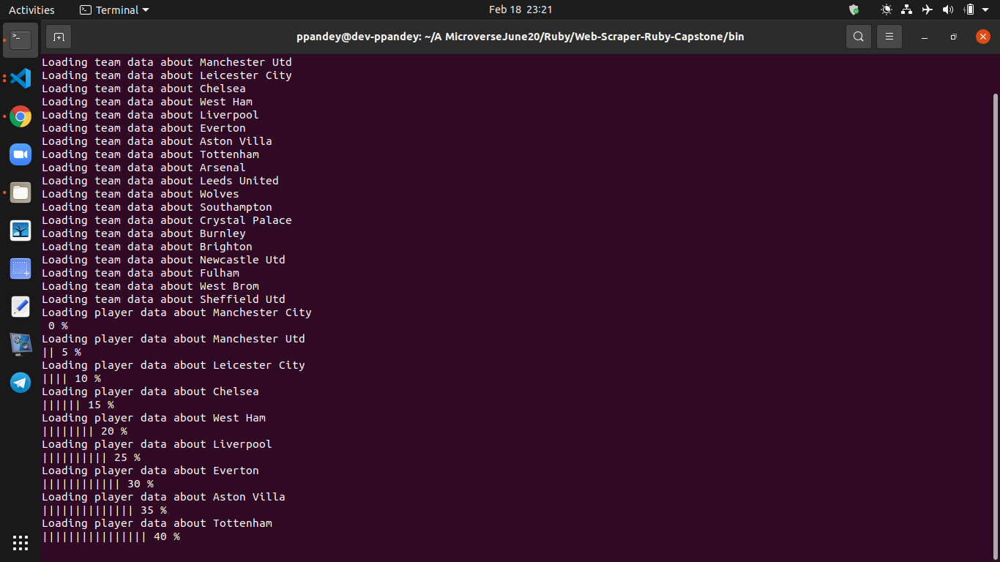
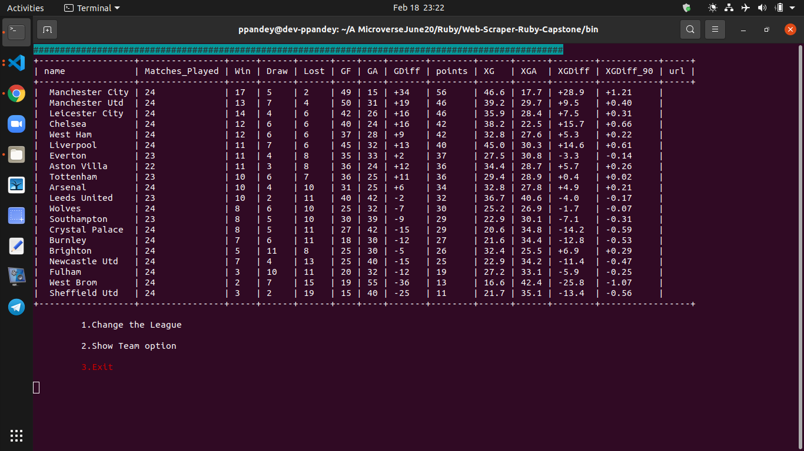

# Soccer Scraper - A Web Scraper for Football Data - Ruby Capstone Project
> This is a Ruby Web scrapper Capstone Project which is made according to [this project specifications](https://www.notion.so/Build-your-own-scraper-f54eaca54d8a4d758a5f0141468127a8#5a09604d441844639a3c53df10a9d1e4). It uses Nokogiri gem to fetch data.

> In this project, football statistics Web Scraper program is built which allows users to get a complete list of information about 5 different leagues. The following stats are analyzed based on the scraped data: -

- [x] League Standing
- [x] Player Statistics
- [x] Suggested Best Starting Team
- [x] Best Attacker
- [x] Best Midfielder 
- [x] Best Defender  in the league

> The suggestions regarding the best starting team and best players are not scraped values but are calculated in the application based on the players performance.

> The program creates a JSON file for all the stats for the user to use and saves locally in the doc folder of the application.
> It uses https://fbref.com/ to scrap all the required data.

## Sample Screenshot

### Scraping status and loading bar


### League table


### Team menu


## Built With

-[x] Ruby
-[x] Nokogiri gem
-[x] open-uri
-[x] colorize gem
-[x] json gem
-[x] terminal-table gem
-[x] VScode

## Project Structure

```
├── bin
│   └── main.rb
└── docs
    └── clubs
    └── players
└── lib
    └── constants.rb
    └── file_handler.rb
    └── interface_data_control.rb
    └── parser.rb
    └── player_scraper.rb
    └── players_rating.rb
    └── show_status.rb
    └── team_scraper.rb
└── media
    └── readme1.JPG
    └── readme2.JPG
    └── readme3.JPG
└── spec
    └── file_handler_spec.rb
    └── Interface_data_control_spec.rb
    └── player_rating_spec.rb
    └── player_scraper_spec.rb
    └── show_status_spec.rb
    └── spec_helper.rb
    └── team_scraper_spec.rb   
├── README.md
├── .rubocop.yml
├── Gemfile.lock
├── Gemfile
├── LICENSE
├── .gitignore
├── .rspec
```
## Prerequisites
1) Ruby
2) CLI (Terminal)
3) Install the gem in the gemfile
## Getting Started

To get a local copy up and running follow these simple example steps.

### Install
You can run those functions in your own local environment. 
To run, you need to install RUBY on your computer. For windows, you can go to [Ruby installer](https://rubyinstaller.org/) and for MAC and LINUX you can go to [Ruby official site](https://www.ruby-lang.org/en/downloads/) for instructions on how to install it.
## Deployment
1) Git clone this repo and change the CLI directory to `Web-Scraper-Ruby-Capstone`.
2) Run `bundle install` in command line to install Nokogiri and other Gems.
3) Run `bin/main.rb`.
4) Select the league you want to get data from and browse through the CLUI
5) Make sure to maximize your terminal window for a better viewing experience.
6) You will get a JSON file of all the data scraped in the ./docs folder.

## Testing the script

This script was tested using [RSpec](https://rspec.info/) which is a ruby testing tool. All public methods are tested.

### Install

- In a terminal window type ```gem install rspec```
- Once rspec install has finished, go to the project directory and type ```rspec --init```
- You will see a folder spec and a file [.rspec](.rspec)
- Inside spec folder you'll see a [spec_helper.rb](spec/spec_helper.rb) file.

### Run the test
- Open a terminal window and type ```rspec```
- All tests should be passed:

## View Files on VSCode like Web Editor (Experimental)

Type `1s` after the `github` in the URL.
Fro Example: 
URL : https://github.com/Prabhakarzx/Web-Scraper-Ruby-Capstone/tree/ruby-web-scraper
View in code : https://github1s.com/Prabhakarzx/Web-Scraper-Ruby-Capstone/tree/ruby-web-scraper

## Author

👤 **Prabhakar Pandey**

- Github: [@Prabhakarzx](https://github.com/Prabhakarzx)
- Twitter: [@Prabhakarzx](https://twitter.com/prabhakarzx)
- Linkedin: [@Prabhakarzx](https://www.linkedin.com/in/prabhakarzx/)
  
## Special Thanks 

- Special Thanks to fellows and friends who helped me out of their busy schedule.

## 🤝 Contributing

Contributions, issues and feature requests are welcome!

## Show your support

Give a ⭐️ if you like this project!

## Acknowledgments

- [x]  Microverse
- [x]  Nokogiri gem
- [x]  https://fbref.com/ 
- [x]  Ruby
- [x]  VScode
- [x]  Rubocop

## 📝 License

This project is [MIT](LICENSE) licensed.
